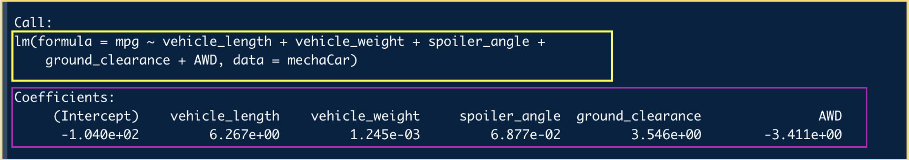
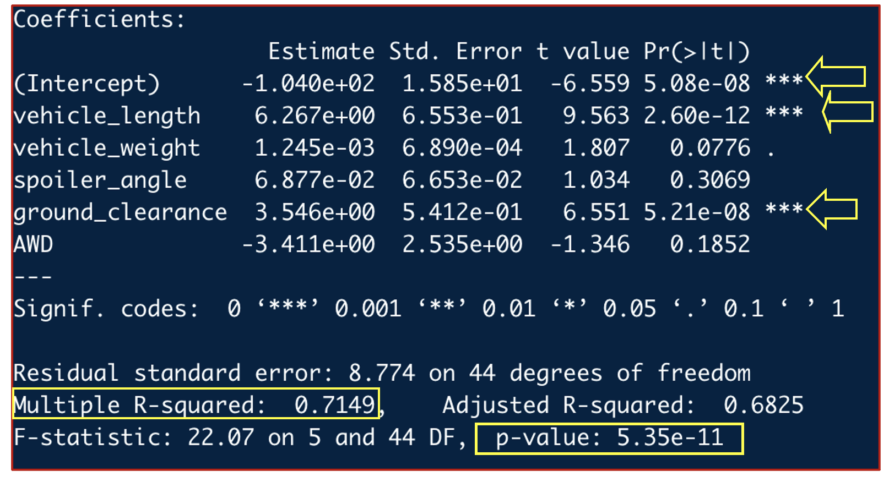
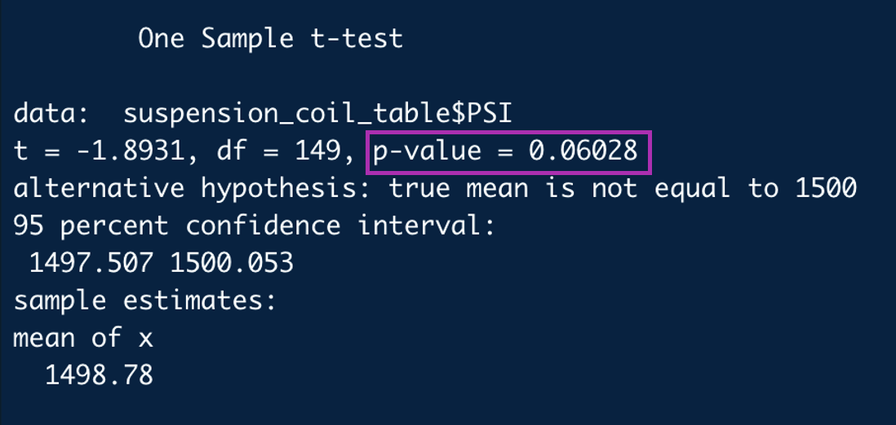
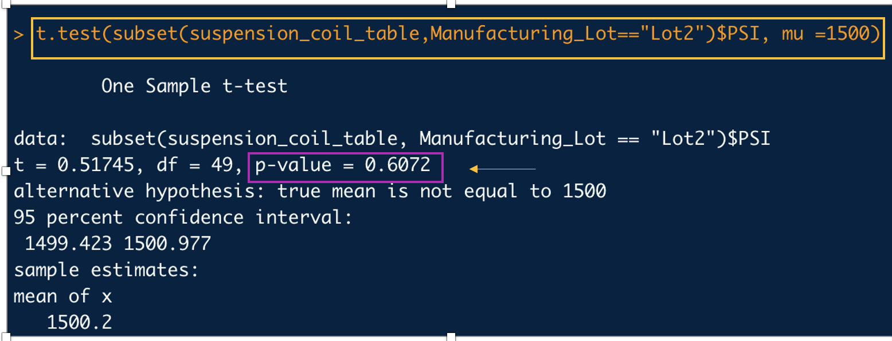
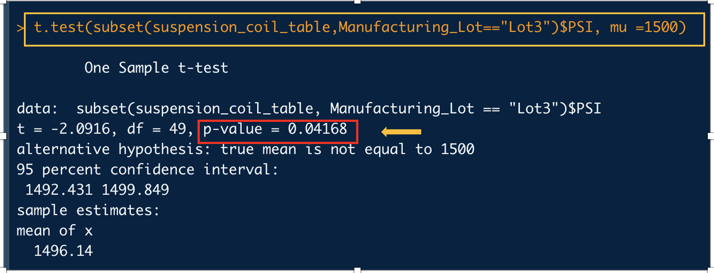

# MechaCar_Statistical_Analysis

## Statistical Analysis on Car Data

## Overview of this Project:

MechaCar,a new prototype from AutoRUs,is suffering from production troubles that are blocking the manufacturing team’s progress. AutosRUs’ upper management and stakeholders are interested in getting an insight into the production data that might be helpful for the production team.

# Results

## 1. Linear Regression to Predict MPG

*Figure 1: The MechaCar dataset head*

The MechaCar data from MechaCar_mpg.csv was loaded in R studio and the above figure shows the head of the dataframe. The attributes of the dataframe are vehicle_length, vehicle_weight,spoiler_angle, ground_clearance,AWD and mpg.

**Multiple Linear Regression Model.**

A multiple linear regression was generated using the built in lm() function.The fuel efficiency (mpg, miles per gallon) is the Dependent variable and to predict the fuel efficiency (mpg) other variables of interest such as vehicle_length, vehicle_weight,spoiler_angle, ground_clearance and AWD  were added as Independent variables to our multiple linear regression model.

The output of multiple linear regression using the lm() function produces the coefficients for each variable in the linear equation.

**Statistical Summary:**
Once we have our multiple linear regression model, we can obtain our statistical metrics using the summary()function.

As data scientists we would be curious about the contribution of each variable to the multiple linear regression model. To determine which variables provide a significant contribution to the linear model, we looked at the individual variable p-values.Each Pr(>|t|) value in the above figure represents the probability that each coefficient contributes a random amount of variance to the linear model. According to our results above,  
* The vehicle_length, ground_clearance also the intercept provide a non-random amount of variance to the mpg values.In other words, the vehicle_length and ground_clearance has a significant impact on the mpg. As indicated by the yellow arrows in the above image, a linear regression model run on these variables against MPG, resulted in p-values of 2.6x10-12 and 5.21x10-8, respectively. The intercept was also statistically significant, indicating that there are likely other factors, not included in our dataset, that have a strong impact on the MPG.
* The r-squared (r-2) value is also known as the coefficient of determination and represents how well the regression model approximates real-world data points.From over data above as indicated in yellow box, the r-squared value is 0.7149 in our multiple linear regression. This r-squared value indicates that the model is 71% accurate.
* The slope of the linear model is not zero, this can be conclude from the p-value.The p-value as indicated in the above picture is 5.35x10-11,which is significantly lower than the value of 0.05.Thus, we can conclude that we can successfully reject our Null hypothesis, in other words there is a significant relationship between mpg and the variables and it is not just random chance.  
* The multiple linear regression model does predict mpg of MechaCar prototypes with some relative effectiveness.The r-squared value is 0.71, hence 71% of all mpg predictions will be determined by this model.

## 2. Summary Statistics on Suspension Coils.

*Figure 2: The Suspension Coil dataset head*

The Suspension Coil data from Suspension_Coil.csv was loaded in R studio and the above figure shows the head of the dataframe. The attributes of the dataframe are VehicleID, Manufacturing_Lot and PSI.

**Total Summary.**

A total_summary dataframe was written in R Script using the summarize() function to get the mean, median, variance, and standard deviation of the suspension coil’s PSI column.

*Total Summary image*

The above total summary image shows the mean, median, variance and standard deviation of all the 150 samples that are in the dataset.

*Lot Summary image*

The lot_summary dataframe was written in R Script using the group_by() and the summarize() functions to group each of the manufacturing lots (lot 1, 2 and 3) by the mean, median, variance, and standard deviation of the suspension coil’s PSI column. The above image shows the mean,  median, variance and standard deviation of Lots 1 2 and 3.   
* It can be summarized from the image above that the mean and median of the three lots are very similar.  
* Lots 1 and 2 meet the design specifications for the MechaCar suspension coils which dictates that the variance of the suspension coils must not exceed 100 pounds per square inch.The variance of lot 1 and lot 2 are 0.98 and 7.47 respectively. However,Lot 3 doesn't meet this specification as it has a variance of 170.28, which is way above the 100 PSI variance specification.
* When looking at the entire population of the production lot(Total summary image), the variance of the coils is 62.29 PSI, which is well within the 100 PSI variance specifications of the company.

The boxplot above illustrates the differences between lots 1, 2 and 3.

## 3. Comparing all manufacturing lots against mean PSI of the population.

The one-sample t-test is used to determine whether there is a statistical difference between the means of PSI across all manufacturing lots and a hypothesized, potential population mean of 1,500 PSI. 
* The metrics produced from the t.test()function in the above image, shows the calculated p-value to be 0.06 for all the manufacturing lots. Since, this value is above the significant value of 0.05 hence, this data is not statistically significant.
* Therefore, we fail to reject the Null hypothesis. In other words, the mean of all the three manufacturing lots is statistically similar to the presumed population mean of 1500.

### Comparing Lot 1 against mean PSI of the population

The image above shows t-test done to compare means of PSI of Lot 1 with a population mean of 1,500 PSI.
* The calculated p-value is 1 as shown in the yellow box.
* Since, the p-value is above the significant value of 0.05,This signifies that the PSI of lot 1 is not statistically different from the population mean
* Hence, we fail to reject the Null hypothesis.

The image above shows t-test done to compare means of PSI of Lot 2 with a population mean of 1,500 PSI.
* The calculated p-value is 0.60 as shown in the magenta box.
* Since, the p-value is above the significant value of 0.05,This signifies that PSI of lot 2 is not statistically different from the population mean of PSI 1500.
* Hence, we fail to reject the Null hypothesis.

The image above shows t-test done to compare means of PSI of Lot 3 with a population mean of 1,500 PSI.
* The calculated p-value is 0.04 as shown in the red box.
* Since, the p-value is slightly below the significant value of 0.05,This signifies that PSI of lot 3 is statistically different from the population mean of PSI 1500.
* Hence, we reject the Null hypothesis. This batch needs to be monitored closely for better results.

## 4. Study Design: MechaCar vs Competition.

I would like to look into the Selling Price of MechaCar with various new age advanced features and compare it with other competitive manufacturers.

### Metrics.

In this study, I would like to collect data for comparable models of cars across all major manufacturers for the following metrics:

* Selling Price: Dependent Variable.  

* Engine choice (Electric, Hybrid, Gasoline / Conventional): Independent Variable. 

* Extra Safety Features: Independent Variable

* Resale Value: Independent Variable

* Average Annual Cost of Maintenance: Independent Variable

* Drowsiness Detection System: Independent Variable

* Adaptive Cruise control: Independent Variable

* Automatic Emergency Braking : Independent Variable

### Null and Alternate Hypothesis.

H0 : There is no statistical difference between the selling price of MechaCar and other competitive manufacturer in these respective genres.

Ha : There is a statistical difference between the selling price of MechaCar and other competitive manufacturer in these respective genres.

### Statistical Test.

I would like to use Multiple linear regression as a statistical model. A multiple linear regression uses multiple independent variables to account for parts of the total variance observed in the dependent variable.

* Generate multiple linear regression model:

lm(Selling_Price ~ Engine_choice + safety_features + resale + maintenance + drowsiness_detection + cruise_control + Energy_braking, data = data)

* Generate summary statistics:

summary(lm(Selling_Price ~ Engine_choice + safety_features + resale + maintenance + drowsiness_detection + cruise_control + Energy_braking, data = data))) 

### Data.

 We would need to collect data on the selling price of MechaCar with the above metrices, as well as from all major competitor vehicles.Once, we have the data of selling price based on the above mentioned matrices the statistical test can be conducted.

